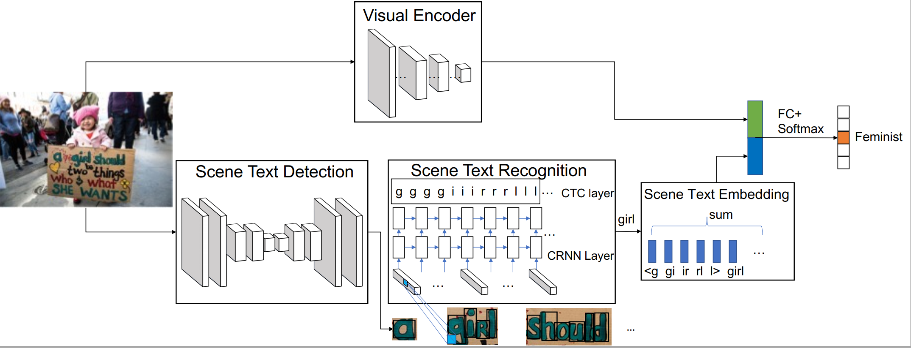
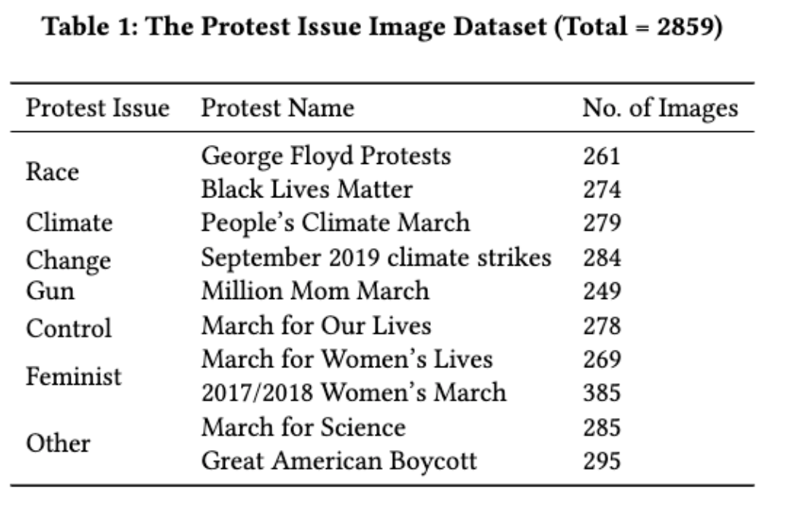
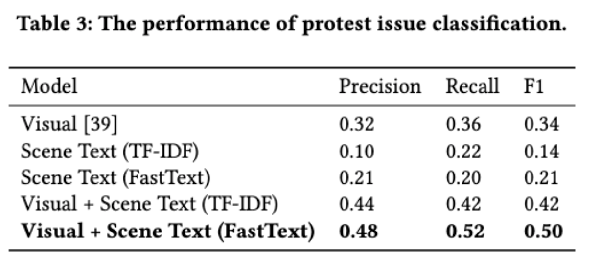

# Protest Issue Classification
The implement of the model is used in the paper "A Joint Scene Text Recognition and Visual Appearance Model for Protest Issue Classification"

# Requirements
[Pytorch](http://pytorch.org/)   
[torchnlp](https://pytorchnlp.readthedocs.io/en/latest/)
[NumPy](http://www.numpy.org/)   
[pandas](https://pandas.pydata.org/)   
[scikit-learn](http://scikit-learn.org/)  

### Model Description
The model contains four main sub-models which are, 1) visual
encoder, 2) scene text detection and recognition, 3) scene text em-
bedding, and 4) protest issue classifier. The model architecture is shown as below:

# Usage
## For only predicting protest issues by pre-trained protest issue classifier
python pred.py --image img1.png --trained_model model.ckpt

## For training your own model
You can train your own protest issue classification model by using your own dataset from step2 to step4.
you can also scrape protest images by implementing step1.
If you want to train classification model of other political event (such as presidential rally classification), just change the keywords in step2

### Train your own protest issue classification model
#### Step0: Scrape protest issue images
You can scrape protest issue images by using the keywords that the protest issue are mostly related. For example, "me too" or "black lives matter"
Then, you can scrape your own protest issue images by doing:
'''python
python main.py -start_step 0 --end_step 0 --keyword "your_keywords"
'''
(if you already have your own dataset, skip this step)

#### Step1: Preprocess
- filter out the images that doesn't include scene text
If you don't want to filter out your dataset, just skip this step. In this case, the joint model will degrade into visual model when the images don't include any scene text.

#### Step2: Detect and Recognize scene text
- recognize scene text from image into id_trans.csv file
We recognize the scene text into id_trans.csv by using the pretrained CRAFT + CRNN model with CTC layers. 
We used the CRAFT and CRNN models, provided by the [easyocr](https://github.com/JaidedAI/EasyOCR) which also included in our project.
For implement, doing:

'''python
python main.py -start_step 2 --end_step 2 --image_dir "your_image_dir"
'''

#### Step3: Train protest issue classification model
Train your own
python main.py --img_dir img_dir1 --img_lab imglab1.csv --stext_emb "fastText" (or "tf-idf")

#### Step4: Predict protest issue by trained protest issue classification model
python pred.py --image img1.png --trained_model model.ckpt

### Train other political event classification model
Same as Section "Train your onw protest issue classification model", but choose different keywords.

#### Performance
The performance of the proposed model, shown as in Table.3, by using the data shown in Table.1.

From these experimental results, we can conclude that 1) our
joint model can identify protest issues substantially better than
the past visual models; and 2) the use of the FastText for the scene
text embedding improves the performance of the model using the
TF-IDF.